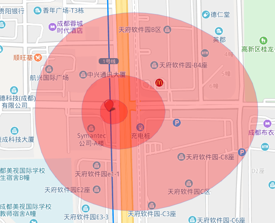

# sp-map

Common Map methods

## Usage

- ### init

- ### CDN

``` html
  <!DOCTYPE html>
  <html lang=en>
  <head>
    <meta charset=UTF-8>
    <meta name=viewport content="width=device-width,initial-scale=1">
    <meta http-equiv=X-UA-Compatible content="ie=edge">
    <title>sp-bmap</title>
    <style>
      #map {
        width: 100vw;
        height: 100vh;
      }
    </style>
  </head>

  <body>
    <div id=map></div>
    <script src="http://api.map.baidu.com/api?v=2.0&ak=DzQo095C0bFagPhpWFXS9aEcIqI0DGfG"></script>
    <script>
    <script src="https://unpkg.com/sp-bmap/dist/index.min.js"></script>
      window.onload = function () {
        var map = __Map.map.init("map");
      }
    </script>
  </body>

  </html>
```

- ### NPM

  ``` node
  npm i sp-bmap //or yarn add sp-bmap
  ```

  ``` js

  let __Map = require("sp-bmap");
  ```

- ### map

  - init(elementId, [lng = 0, lat =0, zoomLevel = 3])

  ``` js
   __Map.map.init("map", lng, lat, zoomLevel);
  ```

  - center([point = (lng = 0, lat = 0)])

  ``` js
  let point = __Map.point(lng, lat);
   __Map.map.center(point);
  ```

  - zoom([zoomLevel = 3])

  ``` js
  __Map.map.zoom(12);
  ```

  - scroll([isScroll = true])

  ```js
  __Map.map.scroll(false);
  ```

  - moveTo(lng, lat)

  ```js
  __Map.map.moveTo(106, 26);
  ```

- ### point([lng = 0, lat = 0])

  ``` js
  __Map.point(lng, lat);
  ```

- ### polygon

- #### egg(radius, [level = 1, lng = 0, lat = 0, options = {}, direction = 'left'])

``` js
      let map = __Map.map.init("map", 110, 30, 16)
      let marker = new BMap.Marker(__Map.point(104.075277, 30.548096))
      map.addOverlay(marker)

      let polygonOptions = {
        fillColor: '#f00',
        fillOpacity: .3,
        strokeWeight: 1,
        strokeOpacity: .3
      }
      let radius = [100, 300, 800]
      radius.forEach(r=>{
        let egg = __Map.polygon.egg(r, 1, 104.075277, 30.548096, polygonOptions)
        map.addOverlay(egg);
      })
```

